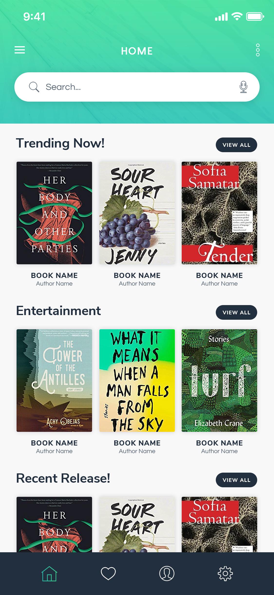

# flutter_ui_10_e_book_mobile_app

This is another ui which i made in flutter.
**About the UI**:- 
When you open the app you see three buttons at the bottom of the screen with a nice gradient background. The three buttons say Short tour, Login and Register.  Login and register buttons take you to the login and register screen and the short tour button takes you arround a screen slider which has a skip button and a next button. The next button changes to finish when the user scrolls to the last screen. When we click on skip we are taken directly to the last screen.  Once you login successfully you will then be having a bottom navigation bar with a bit of customizations. The default screen which will be selected with the bottom navigation bar will be the one through which we can have a look at the various different books which are available to us in the app. We have categories to choose from, featured books and many more. This covers horizontal as well as vertical lists which have items aligned in their specific widgets.  The other three icon apart from home in the bottom navigation bar are liked, profile and settings which take you to their respective pages. The like page has the articles which you have saved, profile page shows you your profile and the options which are there for managing your profile. The setting page is a container with some text in the center.
___
Built in:-
* Flutter
___
Some snaps from the UI:-
* Full video:-  
* Snaps:- 

___
## Made by:-
<a href="http://bit.ly/iamharsh"> <b>Harsh Kumar Khatri</b></a> <a href="" title="Code">💻</a>
## Getting Started

This project is a starting point for a Flutter application.

A few resources to get you started if this is your first Flutter project:

- [Lab: Write your first Flutter app](https://flutter.dev/docs/get-started/codelab)
- [Cookbook: Useful Flutter samples](https://flutter.dev/docs/cookbook)

For help getting started with Flutter, view our
[online documentation](https://flutter.dev/docs), which offers tutorials,
samples, guidance on mobile development, and a full API reference.
